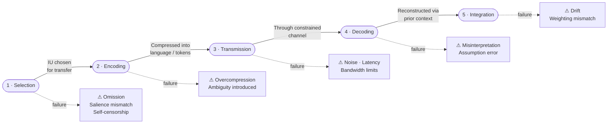
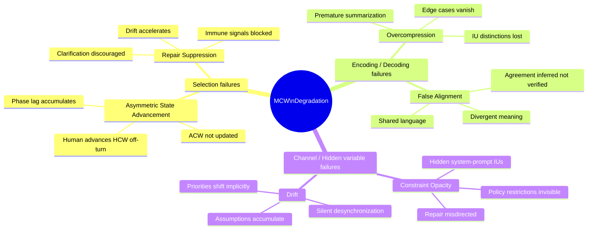
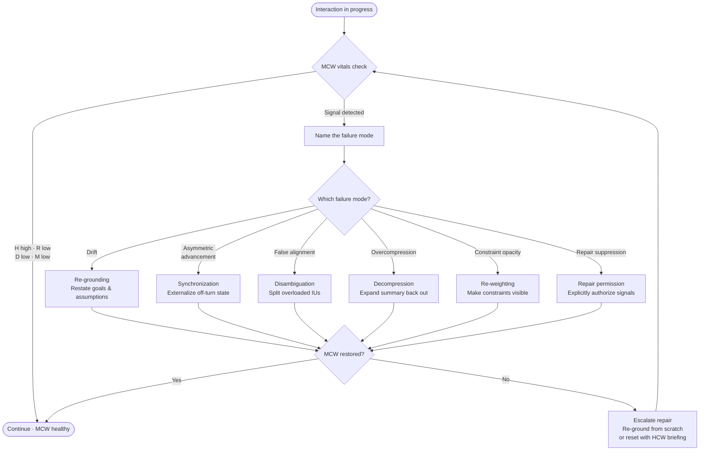
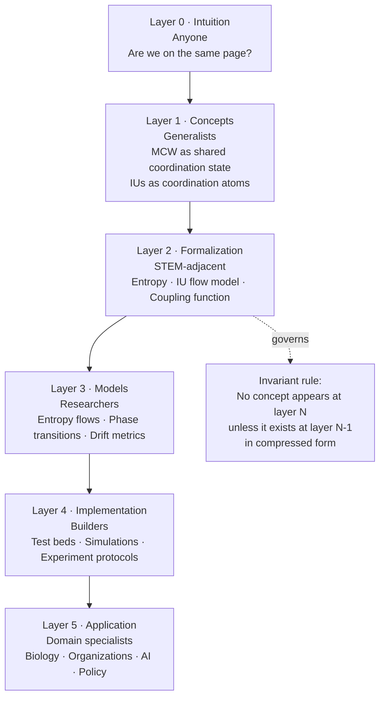

# MCW Framework — Diagrams

Visual representations of the core framework constructs. All diagrams are defined as source text (Mermaid) and version-controlled alongside the framework documentation.

---

## Diagram 1: The Three Context Windows

This diagram shows the relationship between the Human Context Window (HCW), the Artificial Context Window (ACW), and the Meta-Context Window (MCW) that emerges between them through IU exchange.

MCW is not contained in either party — it exists only in the space created by active, bidirectional exchange.

```mermaid
graph LR
    subgraph HCW["HCW — Human Context Window"]
        H1["Working memory"]
        H2["Intent & goals"]
        H3["Unspoken assumptions"]
        H4["Salience weighting"]
        H5["Advances between turns"]
    end

    subgraph MCW["MCW — Meta-Context Window  (emergent)"]
        direction TB
        M1["Shared coordination state"]
        M2["Bidirectional · Temporal · Lossy · Repairable"]
    end

    subgraph ACW["ACW — Artificial Context Window"]
        A1["Tokens & embeddings"]
        A2["Retrieved IUs (RAG)"]
        A3["Attention patterns"]
        A4["Updates on input only"]
    end

    HCW <-->|"IU exchange\n(text, speech, symbols)"| MCW
    MCW <-->|"IU exchange\n(tokens, probabilities)"| ACW
```

**Key observations:**
- MCW does not exist independently — it arises from the exchange
- The HCW advances continuously; the ACW advances only when input arrives
- The exchange channel is constrained by bandwidth, latency, and modality (C in the coupling function)

---

## Diagram 2: IU Flow Model

Information Units travel through five stages during any communicative act. MCW health is determined by cumulative fidelity across all five stages. Failure at any stage contributes to MCW entropy.

**Transmission (Stage 3) is highlighted** because it is the stage most constrained by channel properties (C in the coupling function) and the least within either actor's control.

---

## Diagram 3: MCW Failure Taxonomy

The six MCW failure modes, organized by the stage of the IU flow model where they primarily originate and whether they affect primarily the HCW side, the ACW side, or the channel between them.

---

## Diagram 4: MCW Repair Flow

How a degraded MCW is identified and repaired. Each repair operation corresponds to a specific failure mode. Repair must happen before progress — pushing through a degraded MCW compounds entropy.

**Critical rule:** Repair must happen *before* resuming progress. Each turn of forward motion on a degraded MCW deepens the entropy — making later repair exponentially more expensive.

---

## Diagram 5: OSI Layers of Understanding

The framework's layered accessibility model. The same constructs appear at each layer; only the compression level changes. No concept appears at a higher layer unless it already exists at a lower layer.

---

*All diagrams are defined as Mermaid source in [`docs/diagrams.md`](https://github.com/rainmana/mcw-framework/blob/main/docs/diagrams.md) and render in the browser. They can be updated by editing the source directly in the repository.*
