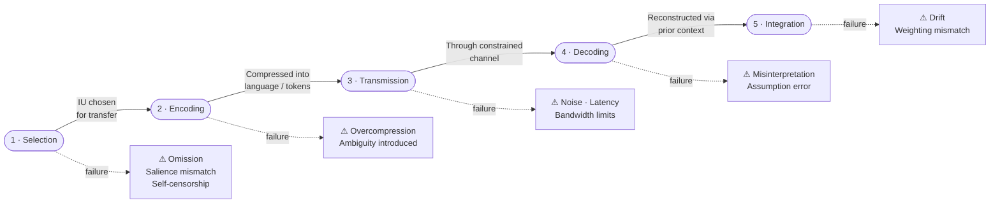
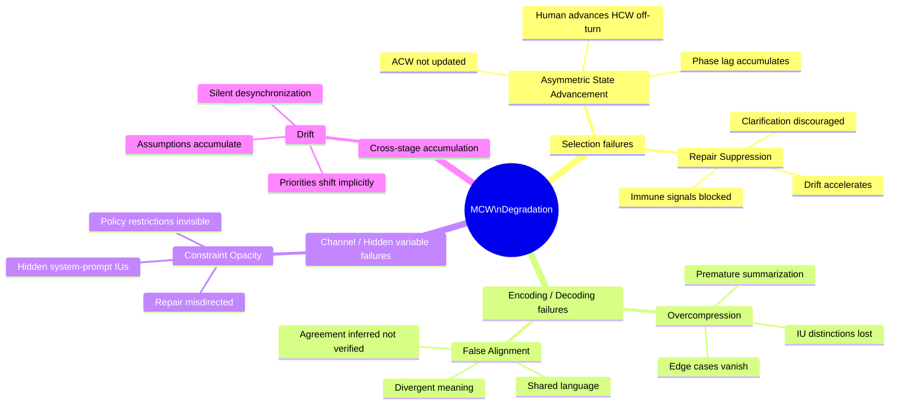
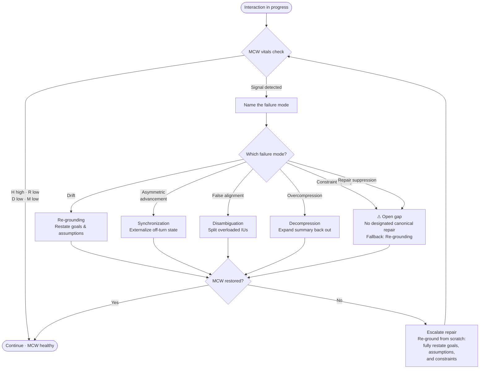
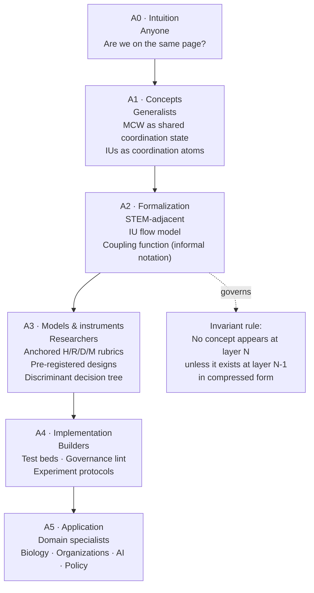
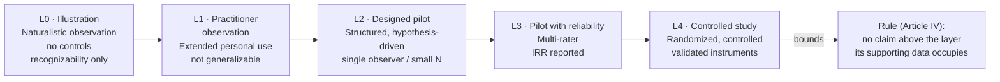

# MCW Framework — Diagrams

**Status:** Visual companion to canon · Evidence: L0 — diagrams illustrate definitions; they are not evidence.

Visual representations of the core framework constructs. All diagrams are defined as source text (Mermaid) and version-controlled alongside the framework documentation.

---

## Diagram 1: The Three Context Windows

This diagram shows the relationship between the Human Context Window (HCW), the Artificial Context Window (ACW), and the Meta-Context Window (MCW) that emerges between them through IU exchange.

MCW is not contained in either party — it exists only in the space created by active, bidirectional exchange.

```mermaid
graph LR
    subgraph HCW["HCW — Human Context Window"]
        H1["Working memory"]
        H2["Intent & goals"]
        H3["Unspoken assumptions"]
        H4["Salience weighting"]
        H5["Advances between turns"]
    end

    subgraph MCW["MCW — Meta-Context Window  (emergent)"]
        direction TB
        M1["Shared coordination state"]
        M2["Bidirectional · Temporal · Lossy · Repairable"]
    end

    subgraph ACW["ACW — Artificial Context Window"]
        A1["Tokens & embeddings"]
        A2["Retrieved IUs (RAG)"]
        A3["Attention patterns"]
        A4["Updates on input only"]
    end

    HCW <-->|"IU exchange\n(text, speech, symbols)"| MCW
    MCW <-->|"IU exchange\n(tokens, probabilities)"| ACW
```

**Key observations:**
- MCW does not exist independently — it arises from the exchange
- The HCW advances continuously and spontaneously; the ACW advances only when input arrives (where input includes tool results and scheduled invocations — see the amended [ACW definition](glossary.md#artificial-context-window-acw))
- The exchange channel is constrained by bandwidth, latency, and modality (C in the coupling function)

---

## Diagram 2: IU Flow Model

Information Units travel through five stages during any communicative act. MCW health is hypothesized to depend on cumulative fidelity across all five stages `[L0]`. Failure at any stage contributes to MCW degradation ("MCW entropy" in the framework's informal usage — see the [glossary](glossary.md#entropy)).

The per-stage labels below (⚠) are **stage risks** — descriptions of what can go wrong at each stage — not the canonical failure-mode taxonomy. Two of them (Overcompression, Drift) are canonical modes; the other three (Omission, Noise/Latency, Misinterpretation) are not, and how each maps onto the canonical six is specified in the [failure-mode ↔ repair mapping](failure_repair_mapping.md#reconciling-diagram-2s-stage-risks-with-the-canonical-modes).

```mermaid
flowchart LR
    S1(["1 · Selection"])
    S2(["2 · Encoding"])
    S3(["3 · Transmission"])
    S4(["4 · Decoding"])
    S5(["5 · Integration"])

    S1 -->|"IU chosen\nfor transfer"| S2
    S2 -->|"Compressed into\nlanguage / tokens"| S3
    S3 -->|"Through constrained\nchannel"| S4
    S4 -->|"Reconstructed via\nprior context"| S5

    F1["⚠ Omission\nSalience mismatch\nSelf-censorship"]
    F2["⚠ Overcompression\nAmbiguity introduced"]
    F3["⚠ Noise · Latency\nBandwidth limits"]
    F4["⚠ Misinterpretation\nAssumption error"]
    F5["⚠ Drift\nWeighting mismatch"]

    S1 -. failure .-> F1
    S2 -. failure .-> F2
    S3 -. failure .-> F3
    S4 -. failure .-> F4
    S5 -. failure .-> F5
```

**Transmission (Stage 3) is highlighted** because it is the stage most constrained by channel properties (C in the coupling function) and the least within either actor's control.

---

## Diagram 3: MCW Failure Taxonomy

The six MCW failure modes, organized by where they primarily *manifest* in the IU flow model. The stage assignments are heuristics about manifestation, not claims about mechanism: Asymmetric State Advancement sits under Selection because the failure is the non-selection of off-turn IUs for externalization; Repair Suppression sits there because the suppressed party stops selecting repair IUs. Drift is deliberately placed on its own cross-stage branch — it is an accumulation phenomenon, not a stage-local event (an earlier version of this diagram placed it under channel/hidden-variable failures, conflicting with Diagram 2's stage-5 placement; see the [reconciliation table](failure_repair_mapping.md#reconciling-diagram-2s-stage-risks-with-the-canonical-modes)).

```mermaid
mindmap
  root(("MCW\nDegradation"))
    Selection failures
      Asymmetric State Advancement
        Human advances HCW off-turn
        ACW not updated
        Phase lag accumulates
      Repair Suppression
        Clarification discouraged
        Immune signals blocked
        Drift accelerates
    Encoding / Decoding failures
      Overcompression
        Premature summarization
        IU distinctions lost
        Edge cases vanish
      False Alignment
        Shared language
        Divergent meaning
        Agreement inferred not verified
    Channel / Hidden variable failures
      Constraint Opacity
        Hidden system-prompt IUs
        Policy restrictions invisible
        Repair misdirected
    Cross-stage accumulation
      Drift
        Silent desynchronization
        Assumptions accumulate
        Priorities shift implicitly
```

---

## Diagram 4: MCW Repair Flow

How a degraded MCW is identified and repaired. Three of the six failure modes have a canonical repair operation whose glossary definition names their mechanism directly (Decompression ↔ Overcompression, Disambiguation ↔ False Alignment, Synchronization ↔ Asymmetric State Advancement). A fourth pairing — Drift → Re-grounding — is this diagram's inference, marked as such in the notes below. The remaining two — Constraint Opacity and Repair Suppression — have **no designated canonical repair operation**; this is an acknowledged gap in the canon, shown honestly below rather than papered over. Repair must happen before progress — pushing through a degraded MCW compounds entropy.

```mermaid
flowchart TD
    A([Interaction in progress]) --> B{MCW vitals check}

    B -->|"H high · R low\nD low · M low"| C([Continue · MCW healthy])
    B -->|"Signal detected"| D[Name the failure mode]

    D --> E{Which failure mode?}

    E -->|Drift| F["Re-grounding\nRestate goals & assumptions"]
    E -->|"Asymmetric\nadvancement"| G["Synchronization\nExternalize off-turn state"]
    E -->|"False alignment"| H["Disambiguation\nSplit overloaded IUs"]
    E -->|Overcompression| I["Decompression\nExpand summary back out"]
    E -->|"Constraint opacity"| J["⚠ Open gap\nNo designated canonical repair\nFallback: Re-grounding"]
    E -->|"Repair suppression"| J

    F --> L{MCW restored?}
    G --> L
    H --> L
    I --> L
    J --> L

    L -->|Yes| C
    L -->|No| M["Escalate repair\nRe-ground from scratch:\nfully restate goals, assumptions,\nand constraints"]
    M --> B
```

**Notes on the mapping:**

- The five canonical repair operations are Re-grounding, Decompression, Re-weighting, Disambiguation, and Synchronization ([Glossary § Repair Operations](glossary.md#repair-operations)). A sixth operation ("Repair permission") appeared in an earlier version of this diagram without being declared as an extension; it has been removed as an undeclared departure from canon (Constitution Articles I and V). The Constraint Opacity / Repair Suppression gap is now addressed properly: two repair operations — **Constraint Disclosure** and **Repair-Norm Restoration** — are proposed as declared Article V extensions, with falsification conditions, in the [failure-mode ↔ repair mapping](failure_repair_mapping.md). They remain extensions, not canon; the canonical count stays five.
- **Re-weighting** (explicitly adjusting IU salience — clarifying which information matters most) has no single designated failure mode. It applies wherever salience mismatch is the underlying cause. An earlier version of this diagram mislabeled Re-weighting as "make constraints visible," which is constraint disclosure, not salience adjustment; the canonical meaning is restored here.
- The Drift → Re-grounding and Constraint-Opacity/Repair-Suppression fallback pairings are the diagram's inference, not canon: the glossary names a target mechanism only for Decompression (reverses overcompression), Disambiguation (addresses false alignment), and Synchronization (closes asymmetric state advancement).

**Critical rule:** Repair must happen *before* resuming progress. Each turn of forward motion on a degraded MCW compounds the damage. The falsifiable form of that claim `[L0]`: repair cost **R is non-decreasing in discovery lag** — the number of exchanges between a misalignment's introduction and its discovery (the [rubrics'](experiments/hrdm_rubrics.md) late-discovery measure). This is an ordering claim, testable by the registered experiments. An earlier version of this caption asserted repair becomes "exponentially more expensive" — a functional form with zero supporting data; that phrasing is withdrawn per Article IV.

---

## Diagram 5: OSI Layers of Understanding (A0–A5)

The framework's layered accessibility model. The same constructs appear at each layer; only the compression level changes. No concept appears at a higher layer unless it already exists at a lower layer. Accessibility layers are written **A0–A5**; bare `L`*n* notation is reserved for the evidence layers (Diagram 6) — an earlier version of this diagram used L0–L5 here, colliding with the evidence ladder.

Each layer's contents below list only what actually exists today. An earlier version advertised "Entropy," "Phase transitions," and "Drift metrics" at A2–A3 — constructs with no formal content anywhere in the framework, which made the diagram violate the very layering invariant it displays. They are removed until they exist.

```mermaid
graph TD
    A0["A0 · Intuition\nAnyone\nAre we on the same page?"]
    A1["A1 · Concepts\nGeneralists\nMCW as shared coordination state\nIUs as coordination atoms"]
    A2["A2 · Formalization\nSTEM-adjacent\nIU flow model\nCoupling function (informal notation)"]
    A3["A3 · Models & instruments\nResearchers\nAnchored H/R/D/M rubrics\nPre-registered designs\nDiscriminant decision tree"]
    A4["A4 · Implementation\nBuilders\nTest beds · Governance lint\nExperiment protocols"]
    A5["A5 · Application\nDomain specialists\nBiology · Organizations · AI · Policy"]

    A0 --> A1 --> A2 --> A3 --> A4 --> A5

    R["Invariant rule:\nNo concept appears at layer N\nunless it exists at layer N-1\nin compressed form"]

    A2 -. governs .-> R
```

---

## Diagram 6: Evidence Ladder (L0–L4)

The evidence layers of [Constitution Article IV](constitution.md#article-iv-epistemic-floor) — a separate ladder from the accessibility layers above. Every empirical claim in the framework carries one of these tags; the current framework sits at L0–L1 everywhere.

```mermaid
graph LR
    L0["L0 · Illustration\nNaturalistic observation\nno controls\nrecognizability only"]
    L1["L1 · Practitioner\nobservation\nExtended personal use\nnot generalizable"]
    L2["L2 · Designed pilot\nStructured, hypothesis-driven\nsingle observer / small N"]
    L3["L3 · Pilot with reliability\nMulti-rater\nIRR reported"]
    L4["L4 · Controlled study\nRandomized, controlled\nvalidated instruments"]

    L0 --> L1 --> L2 --> L3 --> L4

    N["Rule (Article IV):\nno claim above the layer\nits supporting data occupies"]

    L4 -. bounds .-> N
```

---

*All diagrams are defined as Mermaid source in [`docs/diagrams.md`](https://github.com/rainmana/mcw-framework/blob/main/docs/diagrams.md) and render in the browser. They can be updated by editing the source directly in the repository.*
