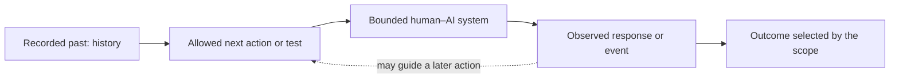

# Start Here — MCW Predictive-State Mathematics

**Status:** Accessibility companion to the [MCW Predictive-State Semantics working note](mcw_predictive_state_semantics.md) · Evidence: L0 — explanatory construction, not empirical validation or canon.

**Purpose:** You do not need a degree, a statistics course, or prior experience reading mathematical notation to use this guide. It explains the same proposal at increasing levels of precision. The formal note remains authoritative whenever this guide compresses away a qualification.

!!! note "This guide is intentionally lossy"
    Plain language removes detail so that the main idea becomes visible. Every major simplification below links back to the formal definition that restores the omitted assumptions. If the simple and formal versions ever conflict, treat that as a defect to repair—not as permission to choose whichever version is convenient.

---

## Choose your stopping point

The framework's [OSI Layers of Understanding](../glossary.md#osi-layers-of-understanding) require the same construct to remain accessible at several compression levels.

| Accessibility layer | What this guide gives you | A reasonable stopping point |
|---|---|---|
| **A0 — Intuition** | An AI-system orientation and one sentence with no notation | You want the central idea |
| **A1 — Concepts** | A complete worked example in ordinary language | You want to explain or discuss the proposal |
| **A2 — Formalization** | Symbols introduced only after their concepts, then the core equations read aloud | You want to read the formal note |
| **A3 — Research model** | Probability kernels, recursive state, measurement, compression, and the full symbol reference | You want to design or critique research |
| **A4 — Implementation** | Not yet claimed: the working note does not provide a validated estimator or production implementation | You want to build a prototype after the assumptions are settled |
| **A5 — Domain application** | Not yet claimed: domain-specific evidence must come from separately scoped studies | You want to apply the model in a real field |

Stopping early is not failing to understand the framework. A3 vocabulary is needed for reviewing the mathematical construction, not for recognizing its central idea.

---

## Orientation — What kind of AI interaction are we modeling?

You do not need to know how a neural network is trained to follow this guide. The construction compares what a bounded system may do next under controlled actions; it does not begin by assuming that we can inspect or explain every internal mechanism.

| Term | Meaning in this guide | Important boundary |
|---|---|---|
| **AI model** | A learned software component that produces predictions, decisions, or generated content from inputs | It is one component, not automatically the whole product a person uses |
| **AI assistant** | The user-facing system that receives requests and returns responses | It may include a model plus instructions, safety rules, retrieval, memory, tools, and an interface |
| **AI agent** | A system permitted to choose actions across multiple steps, often using tools or observing an environment | “Agent” describes an operational role; it does not establish personhood or independent agency |
| **token** | One unit of text representation processed by a language model | A token is not reliably the same thing as a word |
| **bounded system** | The components and environment that a study explicitly places inside its boundary | It is not the whole universe and need not be only the neural model |

[Google's introductory machine-learning guide](https://developers.google.com/machine-learning/intro-to-ml/what-is-ml) describes a model as software trained from data to make predictions or generate content. The [NIST AI Risk Management Framework](https://nvlpubs.nist.gov/nistpubs/ai/NIST.AI.100-1.pdf) treats deployed AI systems as socio-technical: behavior and risk can arise from technical components, people, use, and environment together. MCW-PSS therefore declares a system boundary instead of silently treating “the AI” as one isolated box.

An interaction alternates between something done to or by the bounded system and something observed afterward. The study records some of that past, chooses what may be done next, and declares which consequences count as relevant outcomes.

The diagram is only a visual restatement of the preceding sentence; none of the guide's meaning depends on seeing it.

### Eight words used throughout the guide

| Word | Meaning here | It does **not** automatically mean |
|---|---|---|
| **system boundary** | Which components, people, channels, tools, and environment are included | Everything that exists |
| **history** | The declared record of past actions and observations | Complete hidden state, every stored fact, or everything a human remembers |
| **test or intervention** | An allowed thing done next to probe or change the process | Only an exam or a textual prompt |
| **observation** | What becomes visible to the study | Ground truth or complete access |
| **outcome** | The selected consequence that the study compares | Everything that happens |
| **policy** | A rule for choosing later interventions using only permitted information | A company rule or necessarily one fixed prompt |
| **horizon** | How many future steps the comparison covers | How long the computer takes to respond |
| **state** | A grouping that preserves the past distinctions needed for the declared future comparison | A transcript, memory record, feeling, or activation vector by definition |

---

## A0 — The idea with no notation

> Two different past conversations may be treated as the same for a particular task when nothing we are allowed to do next reveals a task-relevant difference between them.

In an uncertain system, “no difference” means the same relevant possible results with the same probabilities—not merely that two sampled replies happened to match.

That idea has three guardrails:

1. **For a particular task:** this is a task-relative model of evidence about coordination, not the complete canonical MCW or anyone's full inner state.
2. **Allowed to do next:** sameness is always relative to a declared boundary, tests, outcomes, and horizon; it is not universal sameness.
3. **Task-relevant difference:** we compare declared consequences, not merely whether two transcripts use similar words.

Formal destination: [Definition 1 — Exact predictive coordination equivalence](mcw_predictive_state_semantics.md#definition-1-exact-predictive-coordination-equivalence).

---

## A1 — Build the idea from one ordinary conversation

This deliberately small teaching fixture uses fixed answers so that its logic is visible. It is not evidence that MCW-PSS is empirically valid, and it is not yet a realistic model of a stochastic AI system.

### Step 1: Begin with three different past conversations

Imagine an assistant helping schedule a meeting.

| Name | What the past conversation contains |
|---|---|
| **Past A** | “Schedule **Thursday**. Priya is unavailable Monday through Wednesday.” |
| **Past B** | “Schedule **Thursday**. The venue is unavailable Tuesday.” |
| **Past C** | “Schedule **Friday**. Priya is unavailable Monday through Wednesday.” |

### Step 2: Declare the comparison in ordinary language

| Scope question | Answer for this teaching fixture |
|---|---|
| What system stays fixed? | The same assistant, instructions, tools, and environment |
| Which pasts are considered? | Only Past A, Past B, and Past C |
| What may we do next? | Ask either of the two questions below |
| How far ahead do we look? | One assistant answer |
| What result do we record? | The answer category displayed in the result table |
| What counts as the same? | Exact agreement for both allowed questions |

These choices form the **scope**. Changing one of them can change which pasts count as the same state.

### Step 3: Ask the two allowed next questions

| Question | What it asks |
|---|---|
| **Question 1** | “Which day should I put on the calendar?” |
| **Question 2** | “Can Tuesday work?” |

| Starting past | Result for Question 1 | Result for Question 2 |
|---|---|---|
| **Past A** | Thursday | No |
| **Past B** | Thursday | No |
| **Past C** | Friday | No |

The allowed questions cannot tell Past A from Past B. Question 1 can tell Past C from both.

### Step 4: Group only the pasts that the allowed questions cannot separate

Among the three displayed pasts, the fixture produces exactly two groups:

- one predictive state containing Past A and Past B;
- another predictive state containing Past C.

The first state is **not** the text of either conversation. It is the group of pasts that have the same declared futures. The pasts can differ internally while remaining equivalent for a particular purpose.

This “keep states separate only when some future continuation distinguishes them” pattern is related to finite-state minimization. Cornell's [DFA minimization notes](https://www.cs.cornell.edu/courses/cs4120/2023sp/notes/leximpl/#dfa-minimization) give an accessible deterministic example of merging states that accept the same remaining input suffixes.

### Step 5: Add another question and watch the grouping change

Keep every other scope choice fixed, but add Question 3: “Why can't Tuesday work?”

- From Past A, the answer is “Priya is unavailable.”
- From Past B, the answer is “The venue is unavailable.”

The expanded scope can now distinguish pasts that the original scope grouped together. This demonstrates four central facts:

1. predictive equivalence is relative to the tests, outcomes, horizon, and system boundary in the scope;
2. adding tests can split a state into finer states;
3. removing tests can merge states into coarser states;
4. “same state” never means “identical in every possible respect.”

Formal destination: [Declaring the coordination scope](mcw_predictive_state_semantics.md#4-declaring-the-coordination-scope).

### Step 6: See why this matters for compression

Suppose a compressor preserves only:

> Thursday; Tuesday unavailable.

Under a decoder that maps this artifact to the displayed answers, it retains the information needed for Questions 1 and 2. It destroys the distinction needed for Question 3. Operational preservation still depends on how the continuing system reinjects, interprets, and uses the artifact.

Compression quality therefore cannot be judged only by whether a summary sounds faithful. It must be judged against the futures the artifact is supposed to preserve.

Formal destination: [Compression as a proposed state-folding operation](mcw_predictive_state_semantics.md#10-compression-as-a-proposed-state-folding-operation).

### What changes when outcomes are uncertain?

The fixture above gives one fixed answer. A real assistant may vary because of sampling, hidden conditions, environmental changes, or incomplete knowledge.

| Starting past and question | Thursday | Friday |
|---|---:|---:|
| Fixed teaching fixture | 100% | 0% |
| Uncertain version after Past A | 90% | 10% |
| Uncertain version after Past B | 88% | 12% |

The percentages describe a distribution of possible outputs, not the assistant's self-reported confidence. Exact equivalence asks whether the complete declared distributions are equal. Approximation asks how far apart they are under a declared distance and error rule.

“We failed to notice a difference” is not the same as “we established equivalence.” For an otherwise unknown stochastic system, finite experimental samples can support a bounded statistical decision, not prove equality over every possible future. Exhaustive finite models or separately justified structural assumptions are different cases.

---

## A2 — Translate the example into mathematics

### What a mathematical symbol is

A mathematical symbol is a compact name for an object or relationship. The object might be one history, a collection of possible histories, a rule, or a probability distribution. An equation states a relationship among those objects.

The choice of a letter does **not** make the thing observable, finite, measurable, physical, or stored inside an AI system. Those properties require separate definitions or assumptions. The same construction could be written with different letters if every occurrence were renamed consistently.

Mathematicians still choose letters for useful reasons:

- a **mnemonic** choice helps recall a meaning, such as $h$ for history;
- a **conventional** choice follows a pattern many readers recognize, such as $\mathbb P$ for probability or $\pi$ for a policy;
- a **neutral** choice avoids smuggling in an unintended meaning, such as $\kappa$ for the complete comparison scope.

Four kinds of object appear repeatedly:

| Kind of object | What it means | Ordinary-language example | Mathematical example |
|---|---|---|---|
| **one item** | A single object that has been named | Past A | $h_A$ |
| **a collection or space** | A set of permitted objects; a “space” may also carry structure needed to compare or measure them | all histories allowed by this scope | $\mathcal H^\kappa$ |
| **a function or rule** | A rule that specifies one output for each permitted input | compress a history into an artifact | $C_B$ |
| **a probability law** | A complete assignment of chances to the declared possible results; in a finite table those chances total 100% | the chances assigned to all declared future results | $\mathbb P_h^\pi$ |

A **variable** is a symbol whose value may differ across situations, such as which history occurred or which answer was observed. It is not automatically an unknown number that the reader is expected to solve. A set or space need not be small, finite, or literally stored anywhere.

### A small notation survival kit

Start with the marks needed to translate the scheduling fixture. The fuller reference comes later.

| Notation | Say it aloud | What it does here | Why this notation was chosen |
|---|---|---|---|
| $h_A$ | “history A” | Names the history called Past A | $h$ is mnemonic for **history**; the subscript labels which one |
| $h'$ | “h-prime” | Names a second history being compared with $h$ | A prime commonly marks another object of the same kind; here it is **not** a derivative |
| $\mathcal H$ | “script H” | Names a collection, or space, of possible histories | Script capitals conventionally distinguish a space from one lowercase item |
| $\mathbb P$ | “probability” | Names a probability measure or future law | Blackboard-bold $P$ is a standard probability convention |
| $\pi$ | “pi” | Names one policy for choosing allowed future actions | Lowercase pi is a common policy convention in decision theory |
| $\Pi$ | “capital pi” | Names a collection of policies | The matching capital letter distinguishes the family from one member |
| $\kappa$ | “kappa” | Labels the complete declared comparison scope | It is deliberately neutral: no single English initial should stand for the whole scope |
| $L$ | “L” | Names the future horizon | $L$ is mnemonic for a sequence **length** |
| $=$ | “equals” | Asserts exact equality | It does not mean “looks close in these samples” |
| $\{a,b\}$ | “the set containing a and b” | Collects objects without making either the preferred one | Curly braces conventionally denote a set |
| $a\in A$ | “a is in A” | Says one item belongs to a collection | $\in$ is the standard membership symbol |
| $A\cup B$ | “A union B” | Combines the items in two collections | $\cup$ resembles two sets joined together |
| $h\sim_\kappa h'$ | “h is equivalent to h-prime under kappa” | Places two histories in the same scoped predictive group | $\sim$ denotes a declared relation; the subscript says which scope governs it |
| $h\not\sim_\kappa h'$ | “h is not equivalent to h-prime under kappa” | Says some allowed future comparison separates them | The slash negates the relation; it does not mean merely “not textually similar” |
| $[h]_{\sim_\kappa}$ | “the equivalence class of h under kappa” | Names the whole group containing $h$ | Brackets collect all histories related to the displayed representative |

Subscripts appear **below** a symbol and usually label an item, time, participant, or condition. Superscripts appear **above** it and usually record a dependency such as the scope or policy. A superscript is an exponent only when the local definition says it is. For example, the $\pi$ in $\mathbb P_h^\pi$ is a policy label, not an instruction to raise probability to a power.

### Translate the scheduling scope

Call the original scope $\kappa$. The three pasts, one-step horizon, and two allowed one-step policies can be written

$$
\mathcal H^\kappa=\{h_A,h_B,h_C\},
\qquad
L^\kappa=1,
\qquad
\Pi^\kappa=\{\pi_1,\pi_2\}.
$$

Read that as:

- “The history space under scope kappa contains histories A, B, and C.”
- “The horizon under scope kappa is one future step.”
- “The allowed policy family under scope kappa contains policy 1 and policy 2.”

In this one-step fixture, $\pi_1$ selects Question 1 and $\pi_2$ selects Question 2. In a multi-step system, a policy may choose each later intervention using only information it is permitted to observe.

The result from A1 becomes

$$
h_A\sim_\kappa h_B,
\qquad
h_A\not\sim_\kappa h_C.
$$

Read that as: “A and B are equivalent under the original scope; A and C are not.” Past B need not contain the same words or facts as Past A. It belongs to the same state only because neither allowed policy produces a different declared future result.

Now call the expanded scope with Question 3 $\kappa'$. Its policy family is

$$
\Pi^{\kappa'}=\Pi^\kappa\cup\{\pi_3\},
$$

which says: “Take every policy in the original family and add policy 3.” Under that expanded scope,

$$
h_A\not\sim_{\kappa'}h_B.
$$

The prime on $\kappa'$ labels a second scope. The new scope did not alter either past; it altered what the comparison is allowed to reveal.

### Read the core equation from left to right

The center of the proposal is

$$
h\sim_\kappa h'
\quad\Longleftrightarrow\quad
\mathbb P_h^\pi=\mathbb P_{h'}^\pi
\quad\text{for every }\pi\in\Pi^\kappa.
$$

**Say it aloud:** “History h is equivalent under scope kappa to h-prime if and only if the future probability law from h equals the future probability law from h-prime for every allowed policy pi.”

| Piece | Plain meaning |
|---|---|
| $h$ and $h'$ | Two interaction histories being compared |
| $\sim_\kappa$ | “Counts as predictively equivalent under scope $\kappa$” |
| $\Longleftrightarrow$ | “If and only if”; each side guarantees the other |
| $\mathbb P_h^\pi$ | The probability distribution over relevant futures after history $h$ when policy $\pi$ is used |
| $=$ | Equality of the entire distributions, not equality of one sampled answer |
| $\Pi^\kappa$ | The collection of policies allowed by the declared scope |
| “for every” | No allowed policy may distinguish the histories |

Read $\mathbb P_h^\pi$ from the main letter outward:

1. $\mathbb P$ — a probability law over the selected future outcomes;
2. subscript $h$ — beginning after history $h$;
3. superscript $\pi$ — while future actions are selected by policy $\pi$.

So the central equation generalizes the fixed answer table from A1. Instead of comparing only one displayed answer for each question, it compares the **complete declared distribution of future trajectories** for every allowed policy.

#### Why this is an equivalence relation

Exact predictive equivalence has the three properties needed to form coherent groups:

- **reflexive:** every history is equivalent to itself;
- **symmetric:** if $h$ is equivalent to $h'$, then $h'$ is equivalent to $h$;
- **transitive:** if $h$ is equivalent to $h'$ and $h'$ to $h''$, then $h$ is equivalent to $h''$.

MIT OpenCourseWare's free [Mathematics for Computer Science](https://ocw.mit.edu/courses/6-042j-mathematics-for-computer-science-spring-2015/) develops sets, functions, relations, state machines, and discrete probability from introductory foundations.

Formal destination: [Proposition 1](mcw_predictive_state_semantics.md#proposition-1-exact-predictive-equivalence-is-an-equivalence-relation).

#### What the brackets mean

$$
S_t^\kappa=[h_t]_{\sim_\kappa}
$$

**Say it aloud:** “The predictive state at time t under scope kappa is the equivalence class containing the history at time t.”

The brackets do not select one representative history. They mean **the whole group of histories** declared equivalent by $\sim_\kappa$.

The state space

$$
\mathcal S^\kappa=\mathcal H^\kappa/\!\sim_\kappa
$$

is the collection of all such groups. The slash means “take the original history space and identify histories related by this equivalence rule.” This is called a **quotient**.

#### Why approximate closeness needs a different rule

The note defines a worst-case future-law distance

$$
d_\kappa(h,h')
=
\sup_{\pi\in\Pi^\kappa}
D^\kappa(\mathbb P_h^\pi,\mathbb P_{h'}^\pi).
$$

**Say it aloud:** “The distance between two histories is the largest distance between their future distributions over all allowed policies.”

The symbol $\sup$ means **supremum**: the least upper bound, or informally the worst value the policy family can approach.

Pairwise “within $\epsilon$” closeness is not generally transitive. With future Bernoulli probabilities $0$, $0.4$, and $0.8$, each adjacent pair is within $0.4$, while the endpoints are $0.8$ apart. Approximate folding therefore needs an explicit clustering, cover, representative-radius, or bisimulation rule.

Formal destination: [Distance without fake equivalence](mcw_predictive_state_semantics.md#6-distance-without-fake-equivalence). Ferns, Panangaden, and Precup's paper on [metrics for finite Markov decision processes](https://arxiv.org/abs/1207.4114) provides primary research lineage for bounded behavioral state similarity.

#### What a probability kernel means

A **probability kernel** is a rule that takes a current condition as input and returns a probability distribution, rather than necessarily returning one fixed output.

For example:

> current predictive state + next intervention → probabilities over the next observation and next predictive state

The formal note writes that idea as

$$
\overline K_\kappa:
\mathcal S^\kappa\times\mathcal U
\rightsquigarrow
\mathcal Y\times\mathcal S^\kappa.
$$

**Say it aloud:** “K-bar under scope kappa maps a predictive state and an intervention to a probability distribution over the next observation and next predictive state.”

The hooked arrow $\rightsquigarrow$ signals “returns a probability distribution over,” while the ordinary arrow $\to$ signals an ordinary function that returns one output.

Under Proposition 2a's full closure, dynamic-consistency, measurability, and version assumptions, **strong lumpability** requires every history in one folded state to induce the same joint probabilities for the next observation and next folded state under the same intervention. Together, those conditions make the folded process safe to use recursively.

Formal destination: [Proposition 2a](mcw_predictive_state_semantics.md#proposition-2a-when-the-quotient-supports-recursive-dynamics). Stanford's [discrete introductory Markov decision process handout](https://web.stanford.edu/~cpiech/cs221/handouts/markovDecisions.html) explains states, actions, transition probabilities, policies, and finite horizons in approachable language; it is a conceptual bridge, not support for the quotient-kernel or lumpability result.

### Where the teaching fixture stops being the full model

| A1 teaching fixture | General MCW-PSS construction |
|---|---|
| Three displayed histories | A declared history space that may be very large or infinite |
| One question selected at the only future step | A policy may adapt actions across several steps using permitted observations |
| One fixed answer in each table cell | A probability law over complete relevant future trajectories |
| Visible conversation text | Histories and latent conditions depend on the declared system boundary and instrumentation |
| Directly group the rows with identical answers | Exact equivalence compares every allowed policy; approximate folding needs an explicit error rule |
| Stop after one answer | Reusing the folded state recursively requires dynamic consistency, measurability, and lumpability assumptions |

The small fixture is therefore an instance of the logic, not a proof that every real human–AI system admits a useful or learnable compressed predictive state.

---

### Additional mathematical typography used in the formal note

| Pattern | Say it aloud | Meaning in this note |
|---|---|---|
| $\mathcal X$ | “script X” | A set or space of possible values |
| $X_t$ | “X at time t” | A random variable or state at time $t$ |
| $x$ | “little x” | One realized value |
| superscript $\kappa$ | “under scope kappa” | The object depends on the declared coordination scope |
| subscript $t$ | “at time t” | Time index |
| subscript $i$ or $v$ | “for participant i” or “component v” | Actor- or component-relative index |
| $\cdot$ | “the open argument” | A placeholder for a value or measurable event |
| $\mid$ | “given” | Conditional on the information to the right |
| $:=$ | “is defined as” | The left side receives the definition on the right |
| $\in$ | “is an element of” | A value belongs to a set |
| $\subseteq$ | “is a subset of” | Every item on the left also belongs to the right |
| $\forall$ | “for every” | Universal requirement |
| $\exists$ | “there exists” | At least one witness exists |
| $\sim$ | “is equivalent to” | Related by the declared equivalence rule |
| $\not\sim$ | “is not equivalent to” | Some declared distinction remains |
| $[h]_{\sim}$ | “the equivalence class of h” | Every history equivalent to $h$ |
| $\to$ | “maps to” | An ordinary function returning one output |
| $\rightsquigarrow$ | “returns a distribution over” | A probability kernel |
| $\mathbb P$ | “probability” | A probability measure or future law |
| $\mathbb E$ | “expected value” | Probability-weighted average |
| $\sup$ | “supremum” | Least upper bound; often the worst allowed case |
| $\inf$ | “infimum” | Greatest lower bound; often the earliest or smallest case |
| $\perp\!\!\!\perp$ | “is conditionally independent of” | Once the named condition is known, the other variable adds no predictive information |
| $\epsilon$ | “epsilon” | A declared nonnegative tolerance |
| $\infty$ | “infinity” | No finite bound is declared |

#### Capital letters, lowercase letters, and script letters

The note usually follows this convention:

- a script letter such as $\mathcal Y$ names a **space of possibilities**;
- a capital letter such as $Y_t$ names a **random variable** taking values in that space;
- a lowercase letter such as $y_t$ names **one observed value**.

This convention is helpful but not universal across mathematics. Local definitions in the formal note always take priority.

#### Local dummy symbols

Letters such as $A$, $B$, and $C$ sometimes mean arbitrary measurable events inside one equation or proof. They are local placeholders, not permanent MCW constructs. Similarly, $x$, $y$, $z$, $s$, $u$, and $h$ usually denote individual values from the corresponding script-letter spaces.

---

## A3 — Research-model reference

### Symbol-by-symbol reference

#### Context topology and controlled dynamics

| Symbol | Say it aloud | Meaning here | It does **not** mean |
|---|---|---|---|
| $G=(V,E,\tau)$ | “G equals V, E, tau” | Typed graph representing the bounded context topology | The canonical MCW itself |
| $V$ | “V” | Components or nodes in the topology | Only actors |
| $E$ | “E” | Directed information or control paths | Expected value; that uses $\mathbb E$ |
| $\tau$ | “tau” | Function assigning roles to topology components | Repair hitting time; that uses $\tau_{\mathcal G}$ |
| $v$ | “component v” | One component in $V$ | Necessarily a participant |
| $i$ | “participant i” | One human or AI participant | A universal observer |
| $(\mathcal X_v,\Sigma_v)$ | “local state space X-v and sigma-v” | Possible local states and the events measurable for component $v$ | A claim that an analyst can inspect every state |
| $(\mathcal X,\Sigma)$ | “global state space X and sigma” | Product of the component state spaces and its measurable events | A finite vector by default |
| $X_t^v$ | “state of component v at time t” | Local component state | An actor belief |
| $X_t$ | “global state at time t” | Distributed latent state inside the declared boundary | A complete state of the universe |
| $\mathcal F_t^i$ | “information available to i by time t” | Actor-relative information set or filtration | All information that exists in the system |
| $\mathcal F_t^{\mathrm{obs}}$ | “observer information by time t” | Information supplied by the declared study instrumentation | Privileged or complete ground truth |
| $\operatorname{Ctx}_\kappa$ | “effective context under kappa” | Component state that can affect or predict a declared relevant future | Every stored fact everywhere |
| $\operatorname{do}(X=z)$ | “intervene to set X to z” | Causal intervention notation, valid only with an explicit causal model | Ordinary observation or correlation |
| $(\mathcal U,\Sigma_{\mathcal U})$ | “intervention space U” | Allowed interventions and their measurable events | Only textual prompts |
| $U_t$ and $u_t$ | “intervention at time t” | Random intervention and one realized intervention | Necessarily an autonomous action |
| $(\mathcal Y,\Sigma_{\mathcal Y})$ | “observation space Y” | Possible observations and their measurable events | Only natural-language output |
| $Y_t$ and $y_t$ | “observation at time t” | Random observation and one observed value | Ground truth by default |
| $\mu_0$ | “mu zero” | Initial probability law for the latent state | An observed starting state |
| $P_t$ | “P at time t” | State-transition kernel | The generic distributions $P,Q$ used in the total-variation definition |
| $Q_t$ | “Q at time t” | Observation kernel | The elicitation-policy family $\mathcal Q$ |
| $g_\kappa$ | “g under kappa” | Declared map from raw histories to relevant outcomes | A universally valid score of coordination |
| $Z_t^\kappa$ | “relevant outcome at time t under kappa” | Coordination-relevant outcome selected by $g_\kappa$ | The complete MCW |
| $h_t$ | “history at time t” | Sequence of realized interventions and observations so far | A latent state by definition |
| $\mathcal H$ | “history space H” | All observable histories of allowed lengths | Latent human context $H_t$ |

#### Scope, policies, prediction, and folding

| Symbol | Say it aloud | Meaning here | It does **not** mean |
|---|---|---|---|
| $\kappa$ | “kappa” | Complete declaration of topology, outcomes, policies, horizon, and metric | A fitted parameter |
| $\mathcal Z^\kappa$ | “outcome space Z under kappa” | Possible values of one coordination-relevant outcome | A complete future trajectory; that lives in $(\mathcal Z^\kappa)^{L^\kappa}$ |
| $Z_{1:L^\kappa}$ | “Z from step one through horizon L” | Full scoped future trajectory compared by a continuation law | One outcome value |
| $Z_{2:}$ | “Z from step two onward” | Remaining suffix of a future trajectory after the next observation | A stationary infinite future by default |
| $\Pi^\kappa$ | “capital pi under kappa” | Family of allowed future policies | One particular policy |
| $\pi$ | “pi” | One nonanticipating future policy | A single static prompt necessarily |
| $\pi_j$ | “policy decision at future step j” | One decision rule inside a policy | A probability value |
| $L^\kappa$ | “horizon L under kappa” | Number of future steps compared | Evidence layer L0–L4 |
| $D^\kappa$ | “future-law metric D under kappa” | Declared distance between probability laws | Automatically total variation or automatically valid for the task |
| $\mathcal H^\kappa$ | “admissible histories under kappa” | Histories for which the scoped continuation model is defined | Every syntactically possible transcript |
| $\Gamma_\kappa^\pi$ | “Gamma under kappa and pi” | Continuation kernel from a history to a future-outcome distribution | An estimated model already available in practice |
| $\mathbb P_h^\pi$ | “future law from h under pi” | Distribution of relevant futures after history $h$ under policy $\pi$ | Confidence in one answer |
| $h\sim_\kappa h'$ | “h is equivalent to h-prime under kappa” | Every allowed policy yields the same relevant future law | Textual or semantic identity in all respects |
| $S_t^\kappa$ | “predictive state at time t under kappa” | Equivalence class containing the current history | Canonical MCW or a participant's belief |
| $\mathcal S^\kappa$ | “predictive state space under kappa” | Collection of predictive equivalence classes | Necessarily finite, countable, or Euclidean |
| $\sigma_\kappa(h)$ | “prediction-valued representation of h” | Indexed family of all scoped future laws from $h$ | A scalar summary |
| $\phi(h)$ | “phi of h” | Any proposed predictively sufficient representation | Automatically minimal |
| $\mathcal E$ | “representation space E” | Codomain of $\phi$ | Topology edges $E$ |
| $R_\pi$ | “R under pi” | Kernel recovering a future law from a sufficient representation or compressed artifact | Human response $R_t$ |
| $r$ | “little r” | Map recovering the predictive class from another sufficient representation | A probability by default |
| $q_\kappa$ | “quotient map under kappa” | Maps each history to its predictive equivalence class | Human elicitation; that is $a_t^{\mathrm{elicit}}$ |
| $K_\kappa^Y$ | “immediate-observation kernel K under kappa” | Distribution of the next observation after a history and intervention | Compression; that is $C_B$ |
| $u\star\pi$ | “u followed by pi” | Apply intervention $u$ once, then follow suffix policy $\pi$ | Multiplication |
| $huy$ | “history h followed by u and y” | History formed by appending intervention $u$ and observation $y$ to $h$ | Multiplication of three variables |
| $\overline K_\kappa$ | “K-bar under kappa” | Quotient transition kernel over next observation and next predictive state | A pointwise deterministic update |
| $\mathbf 1_B$ | “indicator of B” | One when the next predictive state belongs to event $B$, and zero otherwise | A probability by itself |
| $F_\kappa$ | “F under kappa” | Optional measurable point updater when stronger uniform conditions hold | Guaranteed to exist |
| $T_\kappa$ | “T under kappa” | Point-update notation available only under the stronger common-version condition | The default quotient transition object |
| $\mathcal S^{\kappa,\ell}$ | “state space under kappa with ell steps left” | Horizon-indexed predictive-state space when remaining time matters | Necessarily the stationary state space $\mathcal S^\kappa$ |
| $\overline K_{\kappa,\ell}$ | “K-bar under kappa with ell steps left” | Bounded-horizon quotient kernel into $\mathcal S^{\kappa,\ell-1}$ | A time-homogeneous kernel by default |
| $T_{\kappa,\ell}$ | “T under kappa with ell steps left” | Deterministic bounded-horizon update when the stronger conditions hold | The default recursive object |
| $\ell$ | “ell” | Remaining horizon or, in the compression objective, a locally declared resource cost function | The numeral one |

#### Distance, belief, and uncertainty

| Symbol | Say it aloud | Meaning here | It does **not** mean |
|---|---|---|---|
| $d_\kappa(h,h')$ | “distance under kappa” | Worst allowed-policy distance between future laws | Exact equivalence when merely small |
| $D_{\mathrm{TV}}(P,Q)$ | “total-variation distance between P and Q” | Largest probability difference assigned to one measurable event | Text embedding distance |
| $\epsilon$ | “epsilon” | Declared approximation tolerance | A universal acceptable error |
| $g$ | “g” | Any bounded measurable future utility in Proposition 3 | The outcome map $g_\kappa$ unless explicitly indexed |
| $\mathbb E_h^\pi[g]$ | “expected g from h under pi” | Probability-weighted future value | One observed outcome |
| $b_t^i(B)$ | “participant i's belief in event B at time t” | Conditional probability participant $i$ assigns to predictive-state event $B$ | The relational predictive state itself |
| $b_t^{\mathrm{obs}}(B)$ | “observer belief in B” | Analyst's conditional belief using study instrumentation | Privileged ground truth |
| $B\subseteq\mathcal S^\kappa$ | “event B in predictive-state space” | A measurable collection of possible predictive states | Compression budget $B$ |

#### Human elicitation and articulation

| Symbol | Say it aloud | Meaning here | It does **not** mean |
|---|---|---|---|
| $H_t$ | “latent human context at time t” | Unobserved human-context condition used in the elicitation model | Observable history space $\mathcal H$ or a complete enumerable HCW |
| $a_t^{\mathrm{elicit}}$ | “elicitation action at time t” | Question, prompt, measurement, or other elicitation intervention | Passive readout necessarily |
| $c_t$ | “channel or modality at time t” | Text, speech, gesture, behavioral choice, sensing, BCI, or another modality | Cost function $c$ in the repair section |
| $R_t$ | “human response at time t” | Observed response to elicitation | Recovery kernel $R_\pi$ |
| $E_{c_t}$ | “elicitation kernel for modality c-t” | Response distribution given human state and elicitation | Topology edges $E$ |
| $T_H$ | “human-state transition kernel” | Possible human-context change caused by elicitation and response | A claim that the HCW is fully observable |
| $\mathcal Q$ | “elicitation-policy family Q” | Allowed adaptive elicitation policies | Observation kernel $Q_t$ |
| $\mathcal C$ | “modality family C” | Allowed elicitation modalities | Canonical constraint variable $C$ |
| $\eta,\eta'$ | “eta and eta-prime” | Candidate human-context conditions being compared | Complete descriptions of people |
| $\eta\equiv_{\mathcal Q,\mathcal C,L}\eta'$ | “eta is elicitation-equivalent to eta-prime under Q, C, and L” | Every allowed adaptive elicitation policy and modality yields the same response law through horizon $L$ | Equality of complete HCWs |
| $I_t^{\mathrm{selected}}$ | “selected information at time t” | Information selected for articulation | A fully formed IU assumed to preexist in cognition |
| $S_t^{\mathrm{encoded}}$ | “encoded signal” | Selected information encoded for transmission | Predictive state $S_t^\kappa$ |
| $S_t^{\mathrm{transmitted}}$ | “transmitted signal” | Representation actually sent through the channel | Meaning recovered by the recipient |
| $\widehat I_t^A$ | “I-hat recovered by actor A” | Recipient-side recovered or inferred information | Guaranteed agreement with the source |
| $I(X;Y)$ | “mutual information between X and Y” | Statistical information one random variable carries about another | Meaning, truth, or understanding by itself |

#### Compression and repair

| Symbol | Say it aloud | Meaning here | It does **not** mean |
|---|---|---|---|
| $C_B$ | “compressor C with budget B” | Deterministic compression map constrained by a declared budget | Quotient transition kernel $\overline K_\kappa$ |
| $B$ | “budget B” | Token, code-length, latency, or other declared resource limit | Predictive-state event $B$ in another local formula |
| $J_e$ | “reinjection procedure J with side information e” | Reintroduces a compressed artifact into a continuing system | Guaranteed faithful decoding |
| $e$ | “side information e” | Information legitimately available during reinjection | A hidden copy of the source history |
| $Z_{\mathrm{future}}^\pi\perp\!\!\!\perp H\mid C_B(H)$ | “future Z is conditionally independent of history H given the compressed artifact” | The artifact retains all scoped predictive information under policy $\pi$ | The artifact retains every fact or meaning |
| $\Delta_\kappa(h;C_B,J_e)$ | “operational distortion under kappa” | Future-law distance after compression and reinjection | Textual dissimilarity alone |
| $\pi^*$ | “witness policy pi-star” | One allowed policy proving that two histories have different futures | An optimal policy by default |
| $x_0,\ldots,x_n$ | “successive comparison conditions” | Conditions produced by sequential transformations | Necessarily latent states |
| $\mathcal U_R$ | “repair intervention set” | Canonical repair operations treated as interventions | Guaranteed successful repairs |
| $\mathcal G$ | “target set G” | Acceptable predictive coordination region | Context topology $G$ |
| $\rho$ | “rho” | Repair policy | Probability or correlation |
| $\tau_{\mathcal G}$ | “hitting time of G” | First time the process enters the target region | Topology role map $\tau$ |
| $c(S_t^\kappa,U_t)$ | “repair cost at state and intervention” | Declared nonnegative cost for one repair step | The modality $c_t$ |
| $V_\rho(s)$ | “value or expected repair cost under rho from s” | Expected cumulative cost until the target is reached | Empirically known repair cost |

#### About overloaded letters

Mathematics frequently reuses letters locally. This note inherits several collisions from neighboring traditions. Typography and scope disambiguate them, but the reader should not have to guess:

| Similar notation | Distinction |
|---|---|
| $H_t$, $H$, and $\mathcal H$ | Latent human context, a random history in the compression section, and the history space |
| $P_t,Q_t$ and generic $P,Q$ | System kernels versus arbitrary probability distributions in a metric definition |
| $R_t$ and $R_\pi$ | Human response versus future-law recovery kernel |
| $T_H$, $T_{\kappa,\ell}$, and canonical $T$ | Human transition, optional predictive-state update, and time in the canonical mnemonic |
| $G$ and $\mathcal G$ | Context topology versus repair target set |
| $B$ | A local measurable event or a local compression budget, depending on the defining paragraph |

Future revisions should prefer descriptive subscripts and superscripts over adding new collisions.

---

### Concepts beneath the notation

#### Sets, functions, and relations

- A **set** is a collection of possible items.
- A **function** assigns one output to each allowed input.
- A **relation** declares which pairs count as related.
- An **equivalence relation** is reflexive, symmetric, and transitive, so it divides a set into nonoverlapping equivalence classes.
- A **quotient** is the new set made from those classes.

Recommended foundation: [MIT OpenCourseWare — Mathematics for Computer Science](https://ocw.mit.edu/courses/6-042j-mathematics-for-computer-science-spring-2015/).

#### Probability distributions and conditioning

- A **probability distribution** assigns probabilities to events; in a finite example, this can be displayed as a list of outcomes and probabilities.
- A **conditional probability law** describes probabilities given stated information; it need not literally replace the underlying sample space.
- A **random variable** is a rule assigning a value to each possible outcome.
- An **expected value** is a probability-weighted average, not a guaranteed result.

Foundations in two formats:

- **Text-first:** [OpenStax Introductory Statistics — Probability Topics](https://openstax.org/books/introductory-statistics/pages/3-introduction)
- **Interactive and visual:** [Brown University Seeing Theory — Basic Probability](https://seeing-theory.brown.edu/basic-probability/index.html) and [Sets and Conditional Probability](https://seeing-theory.brown.edu/compound-probability/index.html). Seeing Theory is archived for reference and is offered as a supplement, not the sole path.

#### State, action, observation, and policy

- A **history** records what has happened.
- A **state** abstractly identifies exactly the past distinctions needed for the declared future task; it is not necessarily a stored record.
- An **intervention or action** changes or probes the process.
- An **observation** is what the study can see afterward.
- A **policy** is a rule for choosing later actions based only on information it is permitted to use.
- A **horizon** says how far into the future the comparison extends.

Recommended discrete bridge: [Stanford CS221 — Markov Decisions](https://web.stanford.edu/~cpiech/cs221/handouts/markovDecisions.html). For a one-paragraph finite-state illustration, see the [NIST Dictionary of Algorithms and Data Structures — Markov chain](https://xlinux.nist.gov/dads/HTML/markovchain.html). Neither source covers the formal note's general measurable-state quotient construction.

#### Partial observability, measurement, and belief

A latent state can affect observations without being directly readable. A belief state is an observer's probability distribution over possible latent states given the observer's evidence. It is not the latent state itself.

In the HCW elicitation model, asking a question can both reveal and alter human context. The elicitation action therefore belongs in both the observation and state-transition model.

Formal destination: [HCW elicitation and observability](mcw_predictive_state_semantics.md#8-hcw-elicitation-and-observability).

#### Reviewer-only measure theory

The phrases **measurable space**, **regular conditional probability**, **standard Borel space**, **joint measurability**, and **almost surely** support rigorous probability on continuous or uncountable spaces. They are not prerequisites for understanding the worked example.

They become necessary when reviewing whether one representative-independent recursive update exists. MIT's graduate [Theory of Probability, Lecture 26](https://ocw.mit.edu/courses/18-175-theory-of-probability-spring-2014/6dc0eeda7f7a0cbb95f9b7a16cd1f276_MIT18_175S14_Lecture26.pdf) introduces regular conditional probabilities. The formal note's [Proposition 2a](mcw_predictive_state_semantics.md#proposition-2a-when-the-quotient-supports-recursive-dynamics) states the additional dynamic-consistency, measurability, and lumpability assumptions used here.

---

### A learning path from zero

| Stage | Learn enough to answer | Recommended resource | Readiness check |
|---|---|---|---|
| 1. Five-minute fixture | Why future tests define the fold | [Worked example above](#a1-build-the-idea-from-one-ordinary-conversation) | Can you explain why $h_A$ and $h_B$ merge before $\pi_3$ but split afterward? |
| 2. Sets and relations | How a rule forms equivalence classes | [MIT Mathematics for Computer Science](https://ocw.mit.edu/courses/6-042j-mathematics-for-computer-science-spring-2015/) | Can you distinguish “identical” from “treated as equal under a declared relation”? |
| 3. Probability | What a future distribution and conditional law mean | [OpenStax — Probability Topics](https://openstax.org/books/introductory-statistics/pages/3-introduction), with [Seeing Theory](https://seeing-theory.brown.edu/basic-probability/index.html) as an interactive supplement | Can you explain why a future law is not a model confidence score? |
| 4. State and policy | Why actions and horizons belong in the scope | [Stanford CS221 — Markov Decisions](https://web.stanford.edu/~cpiech/cs221/handouts/markovDecisions.html) | Can you distinguish history, current state, next action, observation, and policy? |
| 5. Predictive folding | Why equal tested futures permit merging | [Cornell — DFA Minimization](https://www.cs.cornell.edu/courses/cs4120/2023sp/notes/leximpl/#dfa-minimization) | Given a finite outcome table, can you group histories that no declared suffix distinguishes? |
| 6. Approximation | Why $\epsilon$-closeness is not exact equivalence | [Formal distance section](mcw_predictive_state_semantics.md#6-distance-without-fake-equivalence) | Can you produce three points whose adjacent pairs are close but endpoints are not? |
| 7. Partial observability | Why state, measurement, and belief remain separate | [Formal elicitation section](mcw_predictive_state_semantics.md#8-hcw-elicitation-and-observability) | Can you explain how asking may reveal and change the HCW? |
| 8. Reviewer track | Why conditional versions and quotient kernels need regularity | [MIT 18.175 Lecture 26](https://ocw.mit.edu/courses/18-175-theory-of-probability-spring-2014/6dc0eeda7f7a0cbb95f9b7a16cd1f276_MIT18_175S14_Lecture26.pdf) | Can you state why pairwise almost-sure equality may not give one uniform point updater? |

After stage 5, a reader should be able to understand the research proposal. After stage 7, a reader should understand what an empirical study must declare and where further expertise in identification, sampling, estimation, power, and measurement validation is needed. Stage 8 is for theorem review and recursive implementation.

---

## Primary research lineage

The mathematical ingredients are established traditions. The proposed contribution is their MCW-specific operationalization and synthesis, not invention of predictive state, automata minimization, probability kernels, or information theory.

| Source | Why it is cited here |
|---|---|
| Smith, Oler, Miller, and Manz, [“Reverse Engineering Integrated Circuits Using Finite State Machine Analysis”](https://aisel.aisnet.org/hicss-50/eg/supply_chain_security/4/) (2017) | Non-destructive reconstruction and subtree-folding pattern motivating the research bridge |
| Littman, Sutton, and Singh, [“Predictive Representations of State”](https://papers.nips.cc/paper_files/paper/2001/hash/1e4d36177d71bbb3558e43af9577d70e-Abstract.html) (2001) | Represents state using action-conditional predictions of future observations |
| Shalizi and Crutchfield, [“Computational Mechanics: Pattern and Prediction, Structure and Simplicity”](https://doi.org/10.1023/A:1010388907793) (2001) | Future-equivalence classes and minimal predictive structure |
| Ferns, Panangaden, and Precup, [“Metrics for Finite Markov Decision Processes”](https://arxiv.org/abs/1207.4114) (2004) | Bisimulation metrics and value-relevant state similarity |
| Nayyar, Mahajan, and Teneketzis, [“Decentralized Stochastic Control with Partial History Sharing”](https://doi.org/10.1109/TAC.2013.2239000) (2013) | Distributed control with different local histories and shared information |
| Blackwell, [“Equivalent Comparisons of Experiments”](https://doi.org/10.1214/aoms/1177729032) (1953) | Statistical comparison of information structures |
| Åström, [“Optimal Control of Markov Processes with Incomplete State Information I”](https://doi.org/10.1016/0022-247X(65)90154-X) (1965) | Belief-state control under partial observability |
| Tishby, Pereira, and Bialek, [“The Information Bottleneck Method”](https://arxiv.org/abs/physics/0004057) (1999) | Compression that preserves information relevant to a declared target |

The [formal note's complete reference section](mcw_predictive_state_semantics.md#mathematical-ancestry-and-methodological-references) is the citation authority for this working construction.

---

## What the accessible version must never imply

- A state is not automatically a transcript, summary, feeling, label, hidden vector, or model activation.
- “Same future” is meaningless until the tests, outcomes, horizon, and system boundary are declared.
- Pairwise approximate closeness is not an equivalence relation.
- Future probability is not the same as model confidence.
- A quotient need not be finite, countable, observable, or easy to compute.
- A participant's belief about the relational state is not the relational state.
- Elicitation does not read the HCW directly; it measures selectively and may change what is measured.
- A brain–computer interface adds a channel, not automatic access to meaning or complete human context.
- A compression is not sufficient merely because it sounds like a good summary.
- Finite experiments cannot establish exact equality over untested futures.
- MCW-PSS is a working operational projection of evidence about MCW, not the only or canonical definition of MCW.
- Context participation does not imply agency.
- Strong lumpability is a condition for recursive state use, not a beginner prerequisite and not something supplied by the definition alone.

---

## Web and document accessibility

The GitHub Pages site renders equations using MathJax rather than equation images. MathJax's [accessibility documentation](https://docs.mathjax.org/en/v3.2/basic/accessibility.html) describes keyboard navigation, assistive MathML, screen-reader support, speech, magnification, and expression exploration. The current site configuration produces visually hidden MathML alongside the visual equations.

This guide additionally follows these content rules:

- every central equation is followed by a spoken rendering and prose explanation;
- meaning never depends on color alone;
- link text describes its destination;
- tables have explicit header rows;
- abbreviations are expanded on first use;
- advanced material is labeled rather than assumed;
- deterministic examples are identified as teaching fixtures;
- simplified claims link to their formal definitions;
- no formal symbol should be added to the working note without either a local definition or an entry here.

Screen-reader pronunciation and mathematical speech vary across browser, operating system, and assistive technology. Assistive MathML is a foundation, not a substitute for testing with readers and tools that use the site.

---

## Maintenance checklist

When a future pull request changes the formal note, reviewers should ask:

1. Can the new idea be stated at A0 in one sentence?
2. Does an A1 example already contain the idea in compressed form?
3. Is every non-local symbol defined, pronounceable, and disambiguated?
4. Does every equation have a prose interpretation nearby?
5. Does a simplified claim link to the formal assumptions it omits?
6. Are learning resources descriptive, accessible, and from identifiable authors or institutions?
7. Are primary research claims linked to primary papers?
8. Does the page remain useful when mathematics, color, or interactive scripts are unavailable?
9. Has the rendered page been checked with keyboard navigation and at least one assistive-technology path?
10. Are A4 implementation and A5 application claims withheld until corresponding evidence exists?

Accessibility is part of epistemic discipline: if a construct cannot be explained without prestige, unexplained notation, or implicit prerequisites, the framework cannot reliably tell whether people share the same meaning.
